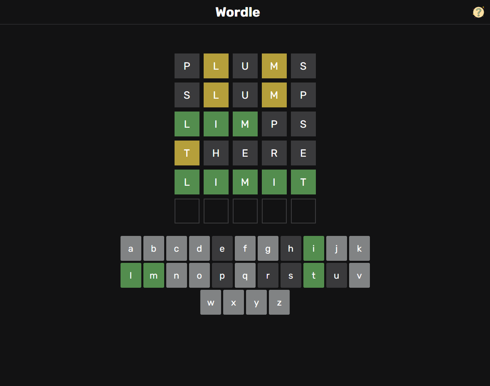
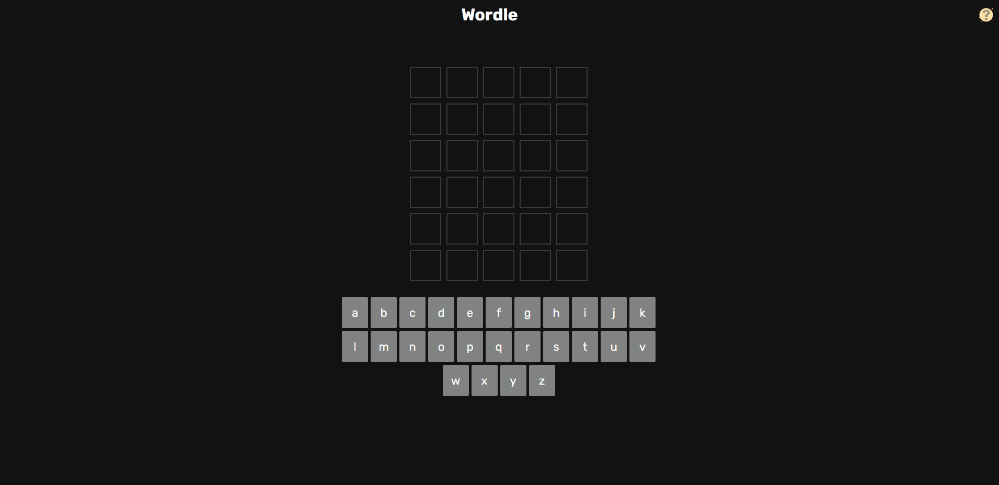

# Wordle Game Clone
This is a clone of the popular word-guessing game called Wordle, implemented using the React framework. 
The game challenges players to guess a hidden five-letter word by making guesses 
and receiving feedback on the correctness of their guesses.    
The main purpose of implementing this game is to practice how to manage global state using React's Context API and the useReducer hook. 
The game fetches words from the [Random Word API](https://random-word-api.herokuapp.com/).

## How to Play
 - The game will display a hidden five-letter word at the start. Your goal is to guess this word.
 - Enter your guess in the input field provided. The game will validate your guess and provide feedback.
 - Feedback will be given in the form of colored squares:
     - A green square indicates that a letter is in the word and in the correct spot.
     - A yellow square indicates that a letter is in the word but in the wrong spot.
     - A gray square indicates that a letter  is not in the word in any spot.
 - Use the feedback to refine your guesses. Keep guessing until you find the hidden word within six attempts.
 - After each guess, the game will display your previous guesses along with the feedback received.
 - Once you correctly guess the word, a popup will appear displaying the result of the game, indicating whether you have won or lost.
 - After closing the popup, another game with a different word will start immediately.

## Overview

## Demo
> This gif shows a brief overview of the project, and it may take a while to load!

## Usage
To run this application locally, follow these steps:

- Clone the repository: git clone https://github.com/mohammedamcs/wordle-clone.git
- Navigate to the project directory: cd wordle-clone
- Install the dependencies and run: npm install && npm start
- Open your web browser and visit: http://localhost:3000
> Make sure you have Node.js and npm (Node Package Manager) installed on your machine before running these commands.
